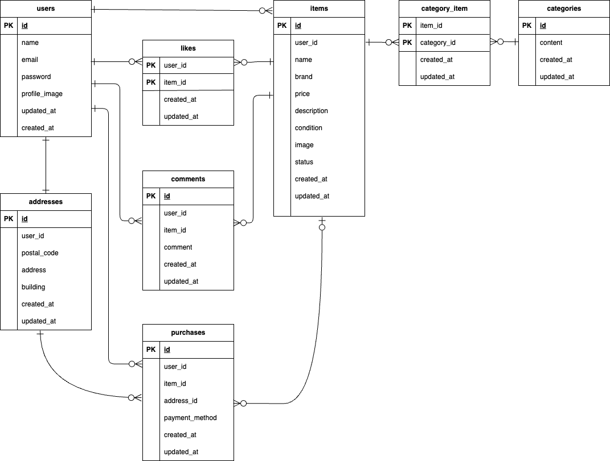

# coachtech フリマ

## 環境構築

### **Docker ビルド**

1. git clone [git@github.com:IshigakiAya/practice-project-flea-market.git](git@github.com:IshigakiAya/practice-project-flea-market.git)
2. docker-compose up -d --build

> **Apple Silicon (arm64) 環境注意点**
> そのまま実行するとエラーになることがあります。
> エラーが発生する場合は、'docker-compose.yml' の mysql, phpmyadmin, mailhog セクションに以下のように `platform` を明示してください。

```yaml
mysql:
    image: mysql:8.0.26
    platform: linux/amd64  # Apple Silicon 対応
    environment:
phpmyadmin:
    image: phpmyadmin/phpmyadmin
    platform: linux/amd64  # Apple Silicon 対応
    environment:
mailhog:
    image: mailhog/mailhog
    platform: linux/amd64  # Apple Silicon 対応
    ports:
      - "8025:8025"
```

### **Laravel 環境構築**

1. docker-compose exec php bash
2. composer install
3. '.env.example' をコピーして '.env' を作成し、以下の環境変数を設定

```env
DB_CONNECTION=mysql
DB_HOST=mysql
DB_PORT=3306
DB_DATABASE=laravel_db
DB_USERNAME=laravel_user
DB_PASSWORD=laravel_pass
```

4. php artisan key:generate
5. php artisan migrate
6. php artisan db:seed
7. php artisan storage:link
8. php artisan serve

### **Stripe 決済機能の設定**

本アプリは Stripe を用いて商品購入の決済画面に遷移します。

1. **Stripe API キーの設定**

   [Stripe ダッシュボード](https://dashboard.stripe.com/test/dashboard)で開発用 API キーを取得

   - 公開可能キー（Publishable key）
   - シークレットキー（Secret key）

2. **.env に以下を追記**

```env
STRIPE_KEY=pk_test_************************
STRIPE_SECRET=sk_test_************************
```

3. **Stripe PHP ライブラリのインストール**

```bash
composer require stripe/stripe-php
```

4. **設定の反映**

```bash
php artisan config:clear
php artisan cache:clear
```

## MailHog によるメール認証

本アプリは、メール認証機能に MailHog を使用しています。

- 認証誘導画面の「認証はこちら」ボタンを押すと、MailHog の Web UI(http://localhost:8025)に遷移し、受信メールを確認できます。
- MailHog の起動は 'docker-compose up -d' に含まれています。
- 差出人メールアドレスは '.env' に以下のように設定してください。

```env
MAIL_MAILER=smtp
MAIL_HOST=mailhog
MAIL_PORT=1025
MAIL_USERNAME=null
MAIL_PASSWORD=null
MAIL_ENCRYPTION=null
MAIL_FROM_ADDRESS=example@example.com
MAIL_FROM_NAME="${APP_NAME}"
```

## 開発環境 URL

- 商品一覧画面（トップ画面）：http://localhost/
- 会員登録画面：http://localhost/register
- phpMyAdmin：http://localhost:8080/
- MailHog:http://localhost:8025/

### テストユーザー情報

ログインには以下のアカウントを使用してください。

- メールアドレス：test@example.com
- パスワード：password

## 使用技術（実行環境）

- php 8.3.0
- Laravel 8.83.29
- MySQL 8.0.26
- nginx 1.21.1
- Font Awesome 6.5.2

## ER 図


